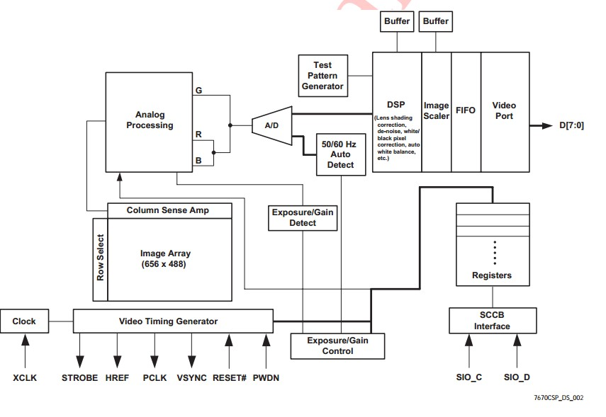
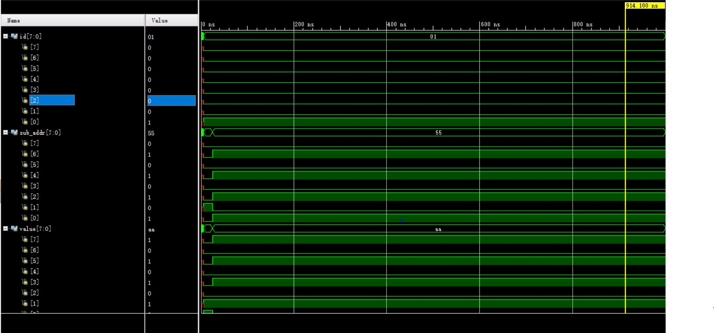

# FPGA Display Driver
## Install Guide
1. Install xlinx vivado tools on your desktop
2. Using git clone command and clone this repository
3. Add project files on Xlinx Vivado working directory
## Project Structure

## Simulation Result

## Advanced Version
I have blocked some files in order to prevent unlicenced modify. If you want to totally modify this project, Please contact me and using Paypal to paid.

My Email address:liuzs1@outlook.com  

My PayPal.Me:paypal.me/LIUZISEN